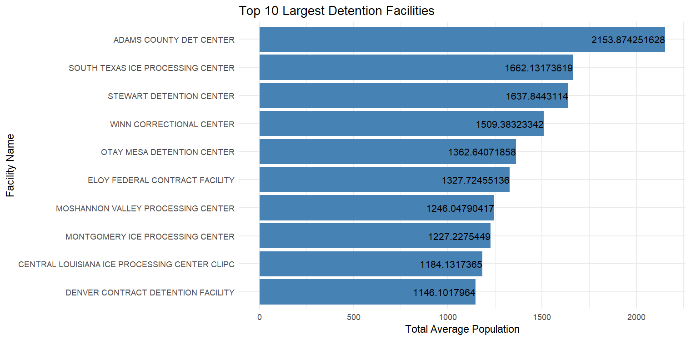

# ICE Detention Facilities Data Analysis

## Project Overview
This project analyzes a dataset containing basic information about detention facilities
holding immigrants in the United States. The dataset is updated semimonthly and includes
facility names, locations, inspection dates, and average population levels (from A to D).

The primary goal of this analysis is to:
- Clean and preprocess the dataset
- Compute total population per detention facility
- Identify and visualize the **top 10 largest detention facilities by population**

---

## Files in This Repository

- `messy_ice_detention.csv`  
  Original dataset containing formatting issues, missing values, and non-standard characters.

- `exercise.R`  
  R script that performs data cleaning, transformation, and visualization.

- `top_10_facilities.png`
  Bar plot of top 10 largest facilities.
  
- `clean_ice_dentention.csv`  
  Cleaned dataset exported after preprocessing.

---

## Interpretation of the Analysis
### Data Loading and Initial Inspection

The analysis begins by loading the ICE detention facilities dataset from a CSV file. 
The first six rows of the file are skipped because they contain metadata rather than tabular data. 
Multiple representations of missing values (such as NA, N/A, blank spaces, and case variations) are standardized during import. 
The structure of the dataset is inspected to understand column types and identify potential data quality issues.

### A. Clean

- The Last.Inspection.End.Date column is a char type containing data in `Excel date serial number` format (e.g: 45673).
  To solve this, it is changed from character type to numeric type and then finally convert to standard date type.
  This is the first time I have came across such date format, so I took help from ChatGPT and here's the prompt link: https://chatgpt.com/share/696a23aa-e404-800a-8343-3b57cc09afb9
- The 'Name' column contains 2 missing values which I filled searching from the google with the help of corresponding city and state name. Smae done for the missing values in city and state. And the data filled is verified from the ICE website.
- The 'Name' column contained ASCII (#, $, %) and non-ASCII characters (like smart spaces, special Unicode symbols, or invisible characters) in random places. All the values were converted to UTF-8 format and replaced invalid characters with a space using iconv() function. Also, the ASCII chars were removed using gsub() function.
- For the missing dates in the `Last Inspection End Date` column, I thought the values could not be reliably determined and also is not essential for our primary purpose. So, I intentionally left it NA instead of filling with random dates.

- Two missing facility names were identified and manually filled using the corresponding city and state information, verified through Google and official ICE resources.
- Facility names contained non-ASCII and special Unicode characters. These were cleaned by converting text to UTF-8 encoding and removing unnecessary characters while preserving readable names.
### B. Analyze

A new "Total Population" column is created by summing the values in “Level A”, “Level B”, “Level C”, and “Level D” columns.
And subset containing the only top 10 largest Detention Facilities is obtained.

### C. Visualization 

For the visualization `ggplot2` package is used. A horizontal bar graph is plotted as a result.



## Requirements

To run this analysis, you need:

- R (version 4.0 or later recommended)
- R packages:
  - `dplyr`
  - `ggplot2`

You can install the required packages using:

```r
install.packages(c("dplyr", "ggplot2"))
